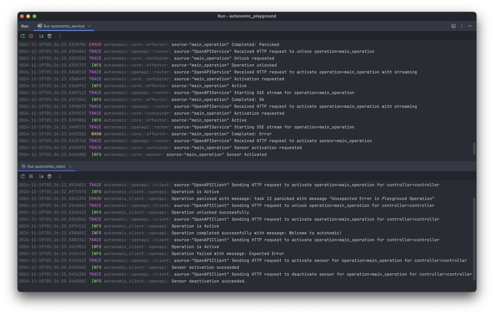

This project is a playground for [autonomic](https://github.com/geo-mak/autonomic).

It has basic server and client implementation with other components to experiment with autonomic.

Currently, all you need is to start the server and use the client to send requests and see how they interact with each other.

More examples will be added in the future to cover other features and components and with more complex scenarios.

## Basic Playbook

```rust
mod openapi;

use tracing::subscriber::set_global_default;
use tracing_subscriber::layer::SubscriberExt;
use tracing_subscriber::{Layer, Registry};

use autonomic::core::operation::OperationResult;
use autonomic::core::serde::IntoAnySerializable;
use autonomic_playground_kit::operations::{Play, PlayParameters};
use crate::openapi::PlaygroundOpenAPIClient;

pub static CONTROLLER: &str = "controller";
pub static MAIN_OPERATION: &str = "main_operation";
pub static SECONDARY_OPERATION: &str = "secondary_operation";

#[tokio::main]
async fn main() {
    // We set up the tracing subscriber to see what is happening in our client
    let filter = tracing_subscriber::filter::EnvFilter::new("autonomic=trace");
    let layer = tracing_subscriber::fmt::layer().with_filter(filter);
    let subscriber = Registry::default().with(layer);
    set_global_default(subscriber).expect("Failed to set global tracing subscriber");

    // Our basic Playbook
    
    // We start by defining some parameters the operations will use
    
    // Ok parameters will return `Ok` with a message
    let ok_params = PlayParameters::new(
        Play::NormalResult(OperationResult::ok_str("Welcome to autonomic!")),
        None,
        0,
    )
        .into_any_serializable();

    // Err parameters will return `Err` with a message
    let err_params = PlayParameters::new(
        Play::NormalResult(OperationResult::err_str("Expected Error")),
        None,
        0,
    )
        .into_any_serializable();

    // Panic parameters will instruct the operation to panic
    let panic_params = PlayParameters::new(Play::Panic, None, 0).into_any_serializable();
    
    // Now we activate the main operation and make it panic with the panic parameters
    PlaygroundOpenAPIClient::activate_operation_stream(CONTROLLER, MAIN_OPERATION, Some(&panic_params)).await;
    
    // When the operation panics, it will be locked, but we can unlock it later, 
    // presumably after investigating the cause of the panic
    PlaygroundOpenAPIClient::unlock_operation(CONTROLLER, MAIN_OPERATION).await;
    
    // We activate the main operation again with the ok parameters
    PlaygroundOpenAPIClient::activate_operation_stream(CONTROLLER, MAIN_OPERATION, Some(&ok_params)).await;
    
    // We activate the main operation again with the err parameters
    PlaygroundOpenAPIClient::activate_operation_stream(CONTROLLER, MAIN_OPERATION, Some(&err_params)).await;
    
    // Now we try to activate the associated sensor with the main operation
    PlaygroundOpenAPIClient::activate_sensor(CONTROLLER, MAIN_OPERATION).await;

    // We wait for 2 seconds to see the sensor in action after its condition is met
    tokio::time::sleep(std::time::Duration::from_secs(2)).await;
    
    // Lastly, we deactivate the sensor
    PlaygroundOpenAPIClient::deactivate_sensor(CONTROLLER, MAIN_OPERATION).await;
}
```

## Console Output

